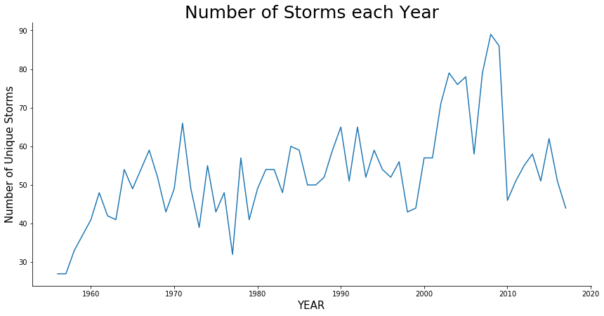
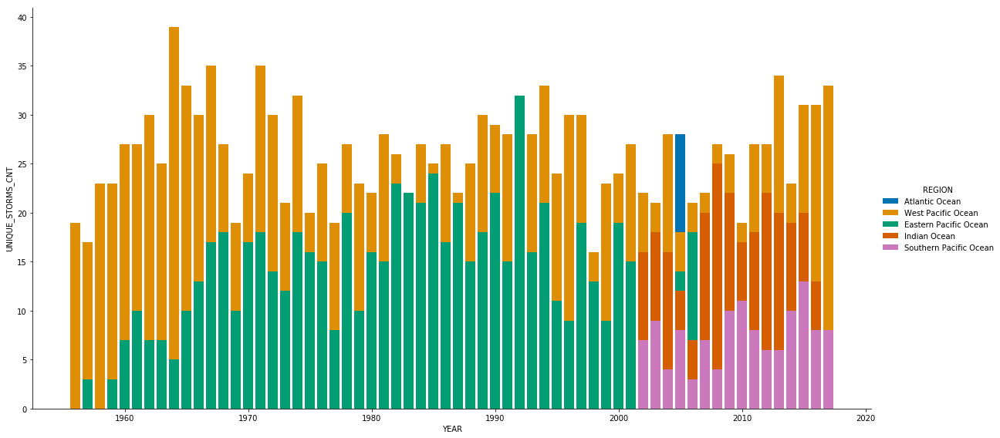
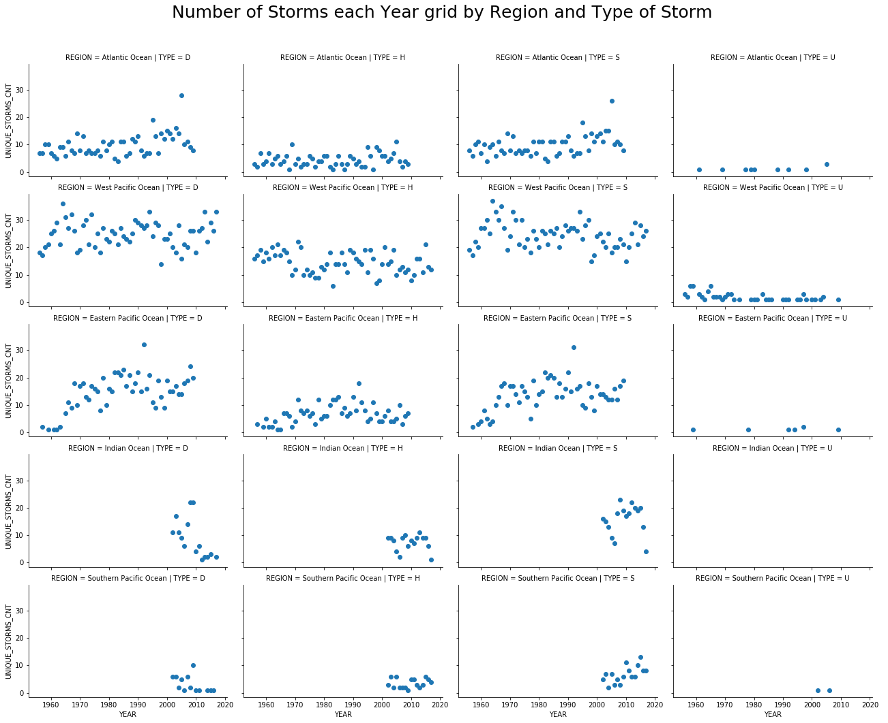
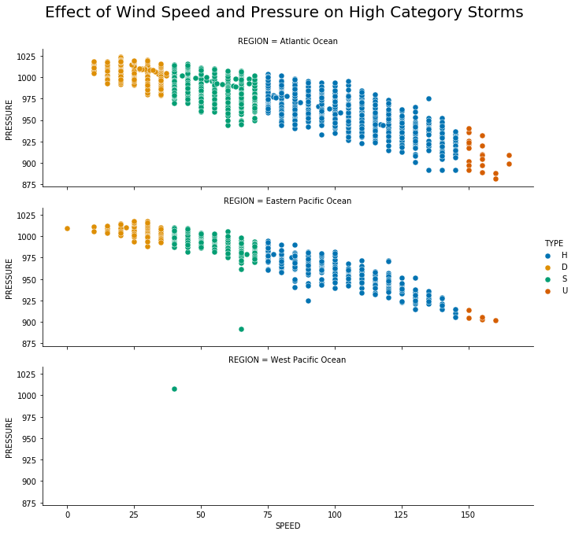

# Historical Storm Data Analysis with Cosmos DB :hand: fa18-523-57 fa18-523-58

| Divya Rajendran, Pramod Duvvuri
| divrajen@iu.edu, vduvvuri@iu.edu
| Indiana University, Indiana University
| hid: fa18-523-57 fa18-523-58
| github: [:cloud:](https://github.com/cloudmesh-community/fa18-523-57/blob/master/project-report/report.md)
| code: [:cloud:](https://github.com/cloudmesh-community/fa18-523-57/tree/master/project-code)

---

Keywords: e534, hid fa18-523-57, fa18-523-58, [Data Visualization](#Visualization), Data Analysis, Cosmos DB, [Machine Learning](#Machine-Learning)

---

## Abstract

The decisions people make these days are all data driven. The amount of data we collect has increased exponentially and this makes it harder to visualize and understand. We can overcome this hurdle by sampling and visualizing subsets of the data. Sampling refers to the process of collecting random subsets of the data. The only thing one should remember is to pick a good sample of the data or to repeat the process of sampling and visualizing the data subset. In this project, we visualized the historical storm dataset and obtained inferences from our visualizations.

## Introduction

With the disastrous effects of the increasing number of storms all around the world, we thought of taking storm dataset for entire Asia Pacific region and visually analyze the effects of various variables on the storms. We want to check any patterns in the storm data and visualize them geographically so that it might help us to make useful inferences on the storm data. We have identified a data set on data.world[@fa18-523-57-DataSet], a community where we find open datasets from various organizations containing varying data attributes according to the need. We try to identify the various correlations among the attributes and understand if they can help explain the change in frequency of the storms.  

## Implementation

### Data set

The data set for the various storms in Asia Pacific region for the years between 1956 and 2017. We have chosen an initial subset of data to visualize locally and then implement the same visualizations on the entire data. The data set contains attributes like region, latitude, longitude, type of category, name, date and hour, speed, and pressure. There are more than 190,000 rows in the dataset. We clean the data for any duplicates, null values and any redundant data before we generate any visualizations.

### Related Work

We have identified an earlier work on tropical storm data using R by Stoltzman consulting LLC and have used it as a base reference to visualize our data using Python [@fa18-523-57-related-work].

## Technologies Used

1. Python is an object-oriented programming language we have utilized in this project [@fa18-523-57-Python].
2. The data is being stored on an Microsoft Azure Cosmos DB [@fa18-523-57-Azure] instance and we will be using Mongo API to connect and retrieve the data.
3. Matplotlib is a 2D visualization library containing a module plotly which gives us publication ready images and we aim to utilize this library to show basic correlation between attributes [@fa18-523-57-matplotlib].
4. Seaborn is a visualization tool based on Matplotlib used to draw attractive statistical plots and we aim to show the change in number of storms per year and other advanced correlations between different attributes [@fa18-523-57-Seaborn].
5. Folium is an interactive mapping tool which plots the data on a map based on the latitude and longitude values [@fa18-523-57-Folium].

The data is stored in the cloud, we are using and instance of Microsoft Cosmos DB, a NoSQL database, for storage. The output of our visualization is shown on jupyter notebook.

## Visualization

This section will contain visualizations of the data and the inferences we draw from them. This section will mostly be data analysis. Here are few questions we hope to answer with our analysis of the data.

1. We start with the basic relationship between the number of unique storms per Year.
  {#fig:storms_per_year}
2. Number of storms per year per region.
  {#fig:storms_per_year_per_region}
3. Number of storms per region per type of storm
  {#fig:storms_year_region_type}
4. Relationship between wind and pressure
5. Correlation between Speed, pressure and category type is identified by visually analyzing them.
  {#fig:relation_wind_pressure_region}
6. Scatter Plot of Altantic Ocean region.
  <link rel="html-import" href="images/fa18_523_57_scatterplot1.html" >

## Machine Learning

### Multinomial Naive Bayes

Multinomial Naive Bayes (MNB) is a simple classifier that uses the Bayes Theorem and assumes independence between the features and is used for multinomially distributed data, since the data is represented in sparse matrix of word vectors this would be ideal for such scenarios. We shall use *sklearn.naive_bayes.MultinomialNB* implementation in our project. We have used various train/test splits to analyze the accuracy of our model. The same has been represented in terms of error in the plot below. The highest accuracy we got was when we used the 80/20 train-test split which gave us an accuracy of split gave us an accuracy of 13.4 % (rounded to nearest decimal point)

## Summary

This section will contain the inference and conclusions we draw after completing this project

## Future Work

In this project, our main aim was to visualize the dataset. After visualizing and making inferences, we would like to propose a model that uses machine learning pattern in our data. We hope to use unsupervised machine learning algorithms to find clusters in our data. This might help us identify further patterns in the data that could not have been possible with just plain visualization of the data. The main problem that we have identified in building such a model is the availability of resources required to run the algorithm without any interruption. Using a local computer resources for running such a model would not be feasible. Hence, we hope to deploy such a model in the cloud and utilize its power and resources for machine learning.

## Acknowledgement

The authors would like to thank Dr. Gregor von Laszewski for giving the opportunity to work on this project and for providing valuable feedback during the duration of our project. The authors would also like to thank the associate instructors of this class for their help and prompt responses to our questions on Piazza. The authors would also like to thank Microsoft for providing a free trial of Azure Cloud services.

## Work Breakdown

The authors Divya Rajendran and Pramod Duvvuri have contributed equally in preparing this report. We shall co-ordinate to equally divide the work that is required to complete the project and the final report before the deadline in December, 2018. Our contributions towards the completion of the project shall be updated in our respective notebook markdown files in our respective git repositories and a summary of our individual contributions shall be added in the final report.
